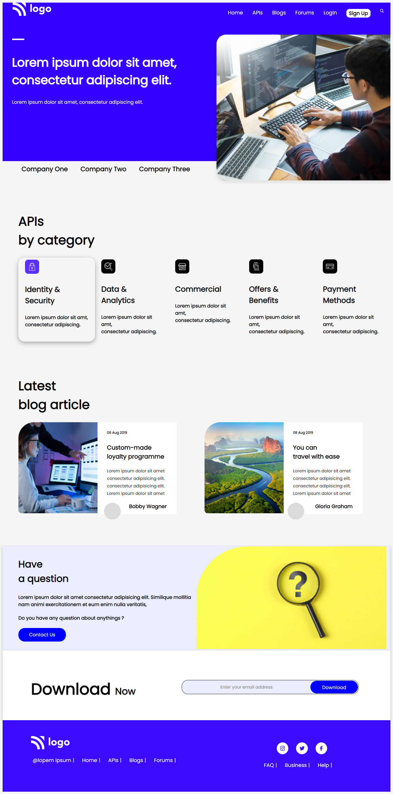

# Project 9

## Software Developer Landing Page

### 🖥️ A Landing Page of a Developer. 💻

  

#### Built Using HTML & CSS (Desktop💻 & Mobile📱 view Only)

#### Time Taken to finish the Project - 5 hours ⌛ (approx)

---

## Things learned from project -

- 
- 
- 
- 
- 

---

## Live Link [Demo](https://manas-ranjan-murmu-project9.netlify.app/)

### Screenshot

---
